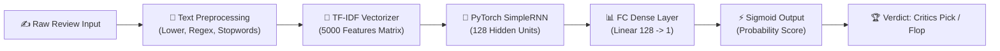

<div align="center">

# 🎬 CinePulse Hollywood — PyTorch SimpleRNN Sentiment Analyzer

[](https://python.org)
[](https://pytorch.org)
[](https://fastapi.tiangolo.com)
[](https://scikit-learn.org)
[](#-model-benchmarks--performance)
[](LICENSE)

*An end-to-end Deep Learning Sentiment Analysis application featuring a **PyTorch SimpleRNN Model** trained on 50,000 IMDB movie reviews and a **Hollywood Gold Dark Mode Web Studio** built with FastAPI and Vanilla Web Technologies.*

</div>

---

## 🌟 Key Highlights

- 🧠 **PyTorch Recurrent Neural Network (RNN)**: Custom `nn.RNN(input_size=5000, hidden_size=128)` architecture trained on 50k IMDB reviews.
- 🎯 **High Accuracy Benchmark**: Achieves **84.90% Test Accuracy** with optimized TF-IDF feature extraction (5,000 max features).
- ⚡ **Sub-Millisecond Inference Engine**: Persisted PyTorch model weights (`rnn_model.pth`) and Scikit-Learn vectorizer (`tfidf_vectorizer.pkl`) for real-time predictions.
- 🎭 **Cinema / Hollywood Gold Dark Mode UI**: Premium dark mode web interface with Playfair Display typography, ambient theater glows, dynamic confidence gauges, and ticket stub presets.
- 🍿 **Batch Review Screening**: Evaluate multiple movie scripts simultaneously with aggregated statistics and table breakdown.
- 🔬 **Preprocessing Lab Inspector**: Interactive step-by-step breakdown visualizing how raw text transforms into cleaned tokens, TF-IDF vectors, and RNN state outputs.

---

## 🏗️ System Architecture & Pipeline



---

## 📸 Web Interface Preview

### 🏆 Critics Pick (Positive Verdict)
> Real-time sentiment evaluation displaying green glowing trophy status, confidence breakdown, and recognized TF-IDF vocabulary pills.

### 💣 Box Office Flop (Negative Verdict)
> Immediate detection of negative sentiment scripts with crimson red indicator badges and probability metrics.

### 🎬 Batch Review Screening
> Screen multiple movie reviews at once with live metrics counters (Total, Positive, Negative) and structured tabular results.

---

## 📊 Model Benchmarks & Performance

| Metric | Benchmark Value |
| :--- | :--- |
| **Dataset** | IMDB 50,000 Movie Reviews Dataset |
| **Input Feature Representation** | TF-IDF Sparse Matrix (5,000 Vocabulary Features) |
| **Neural Network Layer** | PyTorch `nn.RNN(5000, 128, batch_first=True)` |
| **Output Layer** | Linear Dense (128 $\rightarrow$ 1) + Sigmoid Activation |
| **Optimizer** | Adam Optimizer ($\text{lr} = 0.001$) |
| **Loss Function** | Binary Cross Entropy (`BCEWithLogitsLoss`) |
| **Test Accuracy** | **84.90%** |

---

## 📁 Repository Directory Structure

```text
RNN_for_Sentiment_Analysis/
├── RNN_for Sentiment_Analysis.ipynb # Exploratory Data Analysis & Notebook Training
├── train_and_export.py               # Automated PyTorch Model Training & Artifact Export Script
├── sentiment_engine.py               # Core Inference Engine (Text Preprocessing + Model Evaluation)
├── server.py                         # FastAPI Web Server exposing REST APIs & Static Host
├── rnn_model.pth                     # Persisted PyTorch Model State Dict Weights
├── tfidf_vectorizer.pkl              # Persisted Scikit-Learn TF-IDF Vectorizer
├── model_meta.json                   # Saved Model Evaluation Metadata & Hyperparameters
├── IMDB Dataset.csv                  # 50,000 IMDB Movie Reviews Dataset
├── static/                           # Frontend Web Assets
│   ├── index.html                    # Hollywood Gold Dark Theme SPA Interface
│   ├── style.css                     # Glassmorphism & Theater Accent Stylesheet
│   └── app.js                        # Client-Side Interactive Engine & API Fetcher
├── .gitignore                        # Git exclusion configuration
└── README.md                         # Project Documentation
```

---

## 🚀 Quick Start & Installation

### 1. Clone the Repository
```bash
git clone https://github.com/PIYUSH01092004/RNN_for_Sentiment_Analysis.git
cd RNN_for_Sentiment_Analysis
```

### 2. Install Dependencies
```bash
pip install torch scikit-learn nltk fastapi uvicorn pandas numpy
```

### 3. (Optional) Train & Export Model Artifacts
```bash
python train_and_export.py
```

### 4. Launch the Web Server
```bash
python server.py
```

### 5. Open Web Application
Navigate to your web browser:
👉 **[http://localhost:8000](http://localhost:8000)** (or `http://127.0.0.1:8000`)

---

## 📡 REST API Documentation

### 1. Single Review Sentiment Analysis
- **Endpoint**: `POST /api/predict`
- **Request Body**:
  ```json
  {
    "text": "An absolute cinematic masterpiece with extraordinary performances!"
  }
  ```
- **Response**:
  ```json
  {
    "raw_text": "An absolute cinematic masterpiece with extraordinary performances!",
    "cleaned_text": "absolute cinematic masterpiece extraordinary performances",
    "sentiment": "Positive",
    "probability": 1.0,
    "confidence": 100.0,
    "matched_vocab_words": ["absolute", "cinematic", "masterpiece", "extraordinary", "performances"]
  }
  ```

### 2. Batch Review Screening
- **Endpoint**: `POST /api/batch-predict`
- **Request Body**:
  ```json
  {
    "reviews": [
      "Superb action and brilliant direction.",
      "Horrible script, complete waste of time."
    ]
  }
  ```

### 3. Model Benchmark Specs
- **Endpoint**: `GET /api/model-info`

---

## 👤 Author

Developed with ❤️ by **[Piyush Gupta](https://github.com/PIYUSH01092004)**

- GitHub: [@PIYUSH01092004](https://github.com/PIYUSH01092004)
- Repository: [RNN_for_Sentiment_Analysis](https://github.com/PIYUSH01092004/RNN_for_Sentiment_Analysis)

---

<div align="center">
⭐ <i>If you found this project helpful, please consider giving it a star on GitHub!</i> ⭐
</div>
