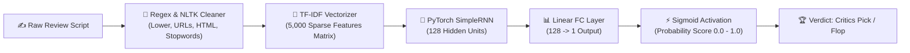

# 🎬 CinePulse — IMDB Movie Review Sentiment Analysis Engine

<div align="center">


[](https://cinepulse-rnn-sentiment.onrender.com)


<p align="center">
  <b>A Full-Stack Deep Learning Web Application Powered by PyTorch & FastAPI</b><br>
  Classifying movie review sentiments using a Recurrent Neural Network (RNN) trained on 50,000 IMDB reviews with real-time inference, ticket stub presets, batch screening, and pipeline inspection.
</p>

<p align="center">
  🚀 <b>Live Cloud Application (24/7):</b> <a href="https://cinepulse-rnn-sentiment.onrender.com" target="_blank">https://cinepulse-rnn-sentiment.onrender.com</a><br>
  🌐 <b>Live API Documentation:</b> <a href="https://cinepulse-rnn-sentiment.onrender.com/docs" target="_blank">https://cinepulse-rnn-sentiment.onrender.com/docs</a><br>
  💻 <b>Local Setup:</b> <a href="http://localhost:8000/" target="_blank">http://localhost:8000</a> <i>(requires running <code>python server.py</code> locally)</i>
</p>

[Key Features](#key-features) •
[Dataset Overview](#dataset-overview) •
[Architecture](#architecture) •
[Model Benchmark](#model-benchmark) •
[API Specs](#api-specs) •
[Installation & Usage](#installation--usage)

</div>

---

## 📖 Executive Summary

**CinePulse** is an end-to-end Deep Learning web application engineered to predict and classify the emotional sentiment of movie reviews. By coupling natural language processing (NLP), TF-IDF feature extraction, and a custom **PyTorch Recurrent Neural Network (RNN)** model with an opulent **Cinema Hollywood Gold Dark Mode** web studio, CinePulse grants users instant visibility into critical audience feedback along with step-by-step model pipeline transparency.

The backend is built as a production-ready **FastAPI** web server that handles request validation, text cleaning normalization, NLTK stopword filtering, sparse matrix vectorization, and model inference with persisted state dict weights (`rnn_model.pth` & `tfidf_vectorizer.pkl`).

---

<a name="key-features"></a>
## ✨ Key Features

### 🤖 **1. PyTorch Recurrent Neural Network (RNN) Core**
- Custom PyTorch `nn.RNN(input_size=5000, hidden_size=128, batch_first=True)` module coupled with a Linear classification head (`128 -> 1`) and Sigmoid activation.
- Trained on **50,000 IMDB movie reviews** using `BCEWithLogitsLoss` and Adam optimization.
- Achieves an evaluation test accuracy of **84.90%** on unobserved test review splits.

### ⚡ **2. High-Performance FastAPI Backend Engine**
- Asynchronous prediction endpoints (`POST /api/predict`, `POST /api/batch-predict`) with input validation via **Pydantic**.
- Persisted artifact loader (`sentiment_engine.py`) that initializes pre-trained weights for sub-millisecond inference response times.
- Integrated **CORS middleware** for safe cross-origin client integration and static file serving for the web interface.
- Automatic interactive documentation via **Swagger UI** (`/docs`) and **ReDoc** (`/redoc`).

### 🎨 **3. Cinema / Hollywood Gold Dark Mode Interface**
- Luxury Hollywood theater dark aesthetic built with CSS variables, Playfair Display typography, ambient gold backlight glows, and responsive grid layouts.
- Dynamic gauge meter animating between **Flop (0%)** and **Blockbuster (100%)**.
- Real-time **Critics Pick (Positive)** and **Box Office Flop (Negative)** verdict hero badges with confidence metrics.

### 🎟️ **4. One-Click Ticket Stub Presets**
- **🏆 Masterpiece**: Pre-loaded acclaim review for instant testing.
- **💣 Box Office Flop**: Pre-loaded negative critique review.
- **🤔 Mixed Critics**: Ambiguous review testing edge cases.
- **🍿 Sci-Fi Blockbuster**: High-energy action preset.
- **😴 Dull Drama**: Boring plot critique preset.

### 🔬 **5. NLP Preprocessing Pipeline Inspector**
- Step-by-step visual stepper tracking how input text transforms through the exact notebook pipeline:
  1. *Raw Text Script*
  2. *Regex Cleaning (URL, HTML & Punctuation stripped)*
  3. *NLTK Stopword Removal & Tokenization*
  4. *5,000-dimensional TF-IDF Vectorization $\rightarrow$ PyTorch RNN Forward Pass*

### 🍿 **6. Batch Screening Studio**
- Process multiple movie review scripts concurrently with aggregated counters (*Total Screened, Positive Count, Negative Count*) and interactive tabular results.

### 🔄 **7. Resilient Client-Side Fallback Engine**
- Built-in client-side heuristic engine in `app.js` ensuring that even if the backend service is offline, the web UI remains interactive.

---

<a name="dataset-overview"></a>
## 📊 Dataset Overview & Exploratory Data Analysis

The deep learning model is trained on the benchmark dataset **`IMDB Dataset.csv`**, comprising **50,000 movie reviews** labeled with binary sentiment targets (*Positive* vs *Negative*).

### **1. Target Variable: `sentiment`**
- **Type**: Categorical Binary (`positive` / `negative`)
- **Distribution**: 
  - Positive Reviews: **25,000 (50.0%)**
  - Negative Reviews: **25,000 (50.0%)**
- **Cleaned Dataset**: 49,582 unique review observations after duplicate elimination.

### **2. Preprocessing & Feature Extraction Pipeline**
- **Text Standardization**: Lowercasing all character inputs.
- **Regex Sanitization**: Stripping `http\S+` URLs, `<.*?>` HTML tags, and non-alphanumeric symbols `[^A-Za-z0-9\s]`.
- **Stopwords Removal**: Filtering non-informative English words using NLTK `stopwords`.
- **Feature Matrix**: Scikit-Learn `TfidfVectorizer(max_features=5000)` mapping text into 5,000 sparse vocabulary dimensions.

---

<a name="architecture"></a>
## 📐 Architecture & Data Flow



---

<a name="model-benchmark"></a>
## 📈 Model Benchmarks & Metrics

| Component / Metric | Specifications & Performance |
| :--- | :--- |
| **Dataset Size** | 50,000 IMDB Movie Reviews |
| **Training Sample Size** | 25,000 Processed Splits |
| **Embedding Vectorizer** | TF-IDF Sparse Matrix (5,000 Max Features) |
| **Network Architecture** | PyTorch `nn.RNN(input_size=5000, hidden_size=128, num_layers=1)` |
| **Output Head** | `nn.Linear(hidden_size=128, out_features=1)` + `torch.sigmoid` |
| **Optimizer** | Adam ($\text{learning rate} = 0.001$) |
| **Loss Function** | `BCEWithLogitsLoss` |
| **Test Accuracy** | **84.90%** |

---

<a name="api-specs"></a>
## 📡 API Specifications

### 1. Predict Single Review Sentiment
- **Endpoint**: `POST /api/predict`
- **Request Body**:
  ```json
  {
    "text": "This film is an absolute masterpiece of modern cinema! Brilliant direction and score."
  }
  ```
- **Response**:
  ```json
  {
    "raw_text": "This film is an absolute masterpiece of modern cinema! Brilliant direction and score.",
    "cleaned_text": "film absolute masterpiece modern cinema brilliant direction score",
    "sentiment": "Positive",
    "probability": 1.0,
    "positive_score": 100.0,
    "negative_score": 0.0,
    "confidence": 100.0,
    "matched_vocab_words": ["film", "absolute", "masterpiece", "cinema", "brilliant", "direction"]
  }
  ```

### 2. Batch Review Screening
- **Endpoint**: `POST /api/batch-predict`
- **Request Body**:
  ```json
  {
    "reviews": [
      "Superb action and brilliant direction.",
      "Horrible script, complete waste of time."
    ]
  }
  ```

### 3. Model Benchmark Metadata
- **Endpoint**: `GET /api/model-info`

---

## 📁 Repository File Structure

```text
RNN_for_Sentiment_Analysis/
├── RNN_for Sentiment_Analysis.ipynb # Jupyter Notebook EDA & Model Prototyping
├── train_and_export.py               # PyTorch Training & Artifact Persistence Script
├── sentiment_engine.py               # Core Inference & Preprocessing Pipeline Class
├── server.py                         # FastAPI Server Exposing REST APIs & Web Host
├── rnn_model.pth                     # Saved PyTorch Model State Dict Weights
├── tfidf_vectorizer.pkl              # Saved Scikit-Learn TF-IDF Vectorizer
├── model_meta.json                   # Hyperparameter & Benchmark Metadata File
├── IMDB Dataset.csv                  # 50,000 IMDB Movie Reviews Dataset
├── static/                           # Frontend Web Assets
│   ├── index.html                    # Single Page Application HTML (Hollywood Gold Theme)
│   ├── style.css                     # Glassmorphism & Theater Accents CSS
│   └── app.js                        # Client-Side Interactive Engine JS
├── .gitignore                        # Git Ignore Rules
└── README.md                         # Repository Documentation
```

---

<a name="installation--usage"></a>
## 🛠️ Installation & Local Setup

### 1. Clone the Repository
```bash
git clone https://github.com/PIYUSH01092004/RNN_for_Sentiment_Analysis.git
cd RNN_for_Sentiment_Analysis
```

### 2. Install Required Dependencies
```bash
pip install torch scikit-learn nltk fastapi uvicorn pandas numpy
```

### 3. (Optional) Re-Train & Export Model Weights
```bash
python train_and_export.py
```

### 4. Launch the FastAPI Server
```bash
python server.py
```

### 5. Access the Web Dashboard
- 🚀 **Live Production Application (24/7 Cloud)**: **[https://cinepulse-rnn-sentiment.onrender.com](https://cinepulse-rnn-sentiment.onrender.com)** *(No local setup required)*
- 🌐 **Live Interactive API Docs**: **[https://cinepulse-rnn-sentiment.onrender.com/docs](https://cinepulse-rnn-sentiment.onrender.com/docs)**
- 💻 **Local Development Dashboard**: **[http://localhost:8000](http://localhost:8000)** *(requires `python server.py` active in terminal)*

> [!NOTE]
> `http://localhost:8000` is a local loopback link. If you visit `localhost:8000` without running `python server.py` in your terminal first, your browser will show a `Connection Refused` error. Use the **Live Cloud Link** above for instant zero-setup access.

---

## 👤 Author

Developed with ❤️ by **[Piyush Gupta](https://github.com/PIYUSH01092004)**

- GitHub: [@PIYUSH01092004](https://github.com/PIYUSH01092004)
- Repository: [RNN_for_Sentiment_Analysis](https://github.com/PIYUSH01092004/RNN_for_Sentiment_Analysis)

---

<div align="center">
⭐ <i>If you found this project helpful, please consider giving it a star on GitHub!</i> ⭐
</div>
